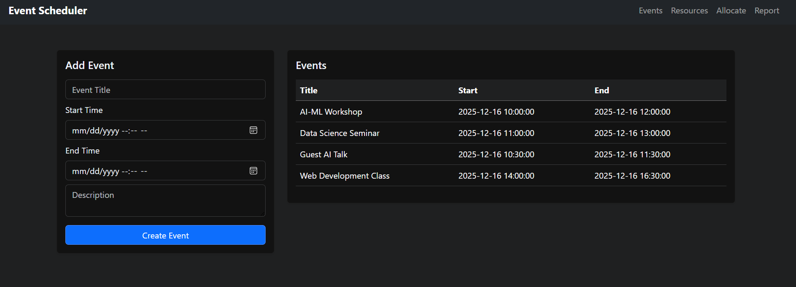
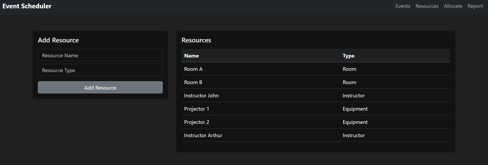
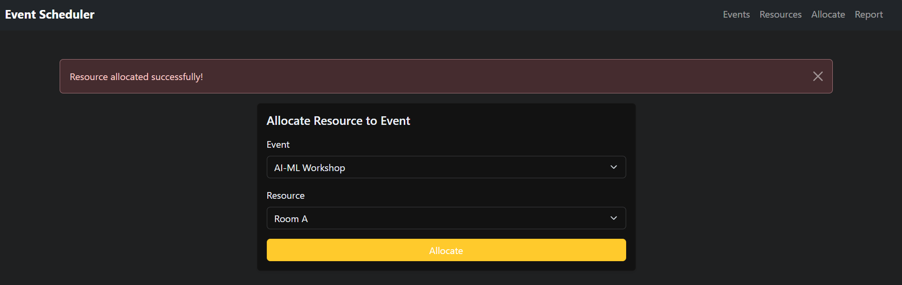
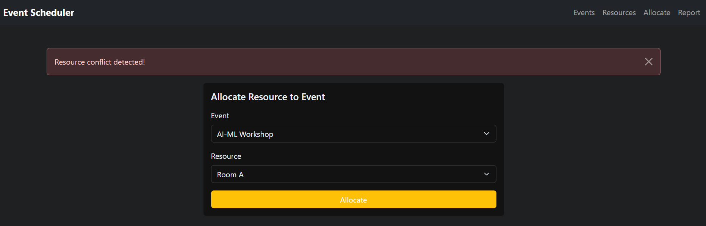
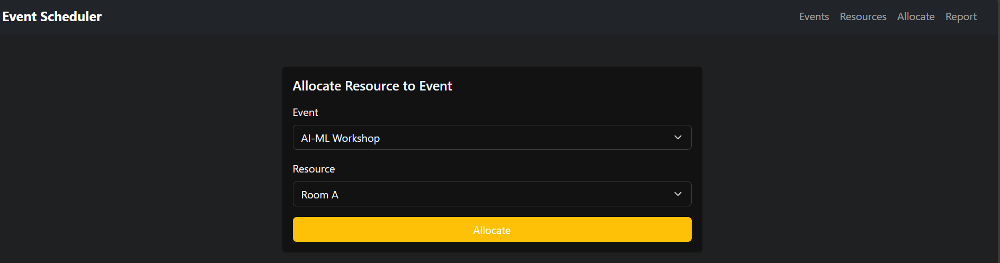
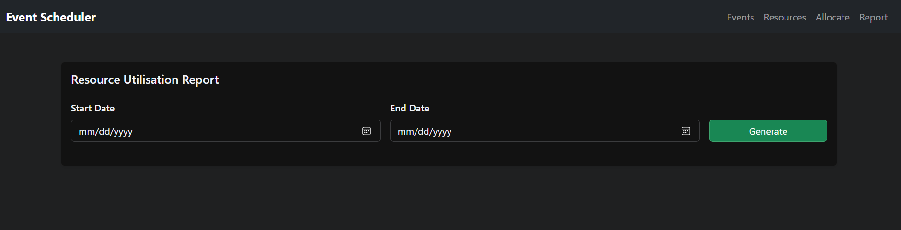
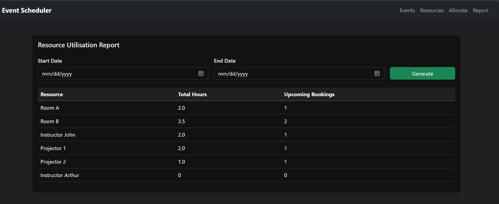
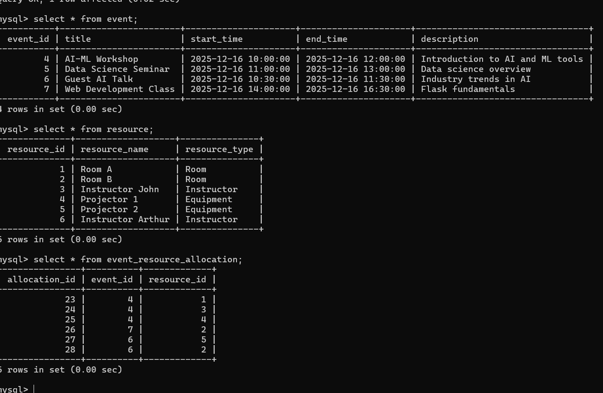

# Event Scheduling & Resource Allocation System

This is a Flask-based web application for managing events and allocating shared resources like rooms, instructors, and equipment.  
The system ensures that resources are **not double-booked for overlapping events** and provides a **resource utilisation report**.

---

## Technologies Used
- Python
- Flask
- MySQL
- SQLAlchemy
- HTML, Jinja2
- Bootstrap

---

## Features

- Create events with start and end time
- Add different types of resources
- Allocate resources to events
- Detect and prevent resource conflicts
- Generate resource utilisation report for a selected date range

---

## Screenshots

Screenshots of the following are included in this repository:

### Events with Overlapping Times

### Resource Management

### Successful Resource Allocation

### Resource Allocation Conflict Detection

### Allocate Resource Page

### Resource Utilisation Report (Input Form)

### Resource Utilisation Report (Generated Output)

### Database Tables 

---

## Demo Video

A screen-recorded demo video showing the full working of the application is provided below:

👉 **Demo Video Link:**  
(https://drive.google.com/file/d/1bclD33eVmsg-ywOQZO6nDRaKdrw-3l1P/view?usp=sharing)

---

## How to Run
1. Download/clone the repository  
2. Create a virtual environment and install dependencies:

   `pip install -r requirements.txt`
3. Create a MySQL database named event_scheduler

4. Update database credentials in app.py

5. Run the app: `python app.py`

6. Open http://127.0.0.1:5000/events in the browser